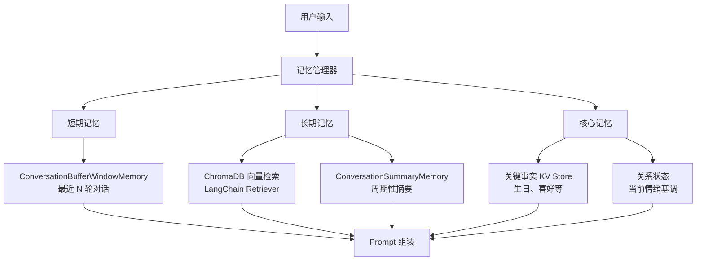
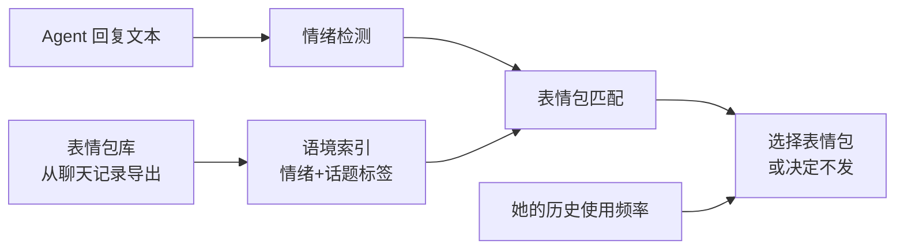
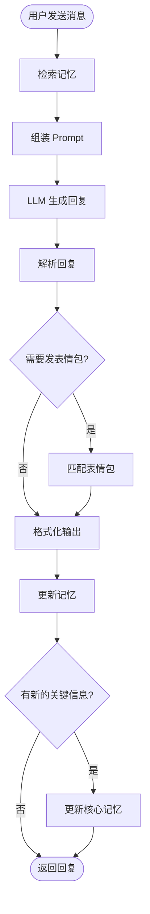

# 赛博女友 Agent - 完整实现计划

> 从零搭建一个基于微信聊天记录的"赛博女友"对话 Agent，涵盖数据导出、预处理、人设提取、RAG 记忆系统、表情包系统、上下文感知对话，以及 Web UI 部署。

---

## 0. 技术选型


| 层面        | 选择                                                              | 说明                                                                   |
| --------- | --------------------------------------------------------------- | -------------------------------------------------------------------- |
| 语言        | Python 3.11+                                                    | AI 生态最成熟                                                             |
| Agent 框架  | **LangChain 0.3+ / LangGraph**                                  | LangChain 负责 LLM 调用、Embedding、向量检索等基础设施；LangGraph 负责 Agent 流程编排（状态机） |
| LLM       | DeepSeek-V3 / Qwen-Max                                          | 中文语境优秀、性价比极高；通过 `ChatOpenAI` 兼容接口统一调用，支持一键切换到 GPT-4o / Claude        |
| Embedding | `BAAI/bge-large-zh-v1.5`（本地首选）或 OpenAI `text-embedding-3-small` | 本地模型免费且中文效果极佳                                                        |
| 向量数据库     | ChromaDB                                                        | 本地轻量，零运维，LangChain 原生支持                                              |
| 前端        | Gradio                                                          | 快速出 Web 聊天界面 MVP                                                     |
| 部署        | 本地优先                                                            | 后续可容器化或接入微信机器人                                                       |


### 为什么用 LangChain

LangChain 在本项目中承担**基础设施层**角色：

- **LLM 调用统一化** — `ChatOpenAI` 一个类覆盖所有 OpenAI-compatible API（DeepSeek、Qwen、GPT、Claude），切换模型只改 `base_url` + `api_key`
- **RAG Pipeline** — `Chroma` + `RecursiveCharacterTextSplitter` + Retriever 开箱即用，几行代码完成向量检索
- **记忆抽象** — `ConversationBufferWindowMemory`（短期）、`ConversationSummaryMemory`（摘要）、`ConversationEntityMemory`（实体记忆）有天然对应
- **LangGraph 状态机** — Agent 的决策流（判断发不发表情包、要不要更新记忆、情绪状态转移）用 LangGraph 的有向图编排，清晰可控

**自定义部分**（不依赖 LangChain 内置）：

- 人设分析引擎
- 表情包管理与匹配系统
- 核心记忆的 key-value 存储与更新逻辑
- Prompt 组装策略

---

## 1. 微信聊天记录导出与预处理

### 1.1 数据导出

微信聊天记录导出推荐工具：

- **[PyWxDump](https://github.com/xaoyaoo/PyWxDump)**（Windows）— 解密微信本地数据库，导出为 JSON/CSV/HTML
- **[WeChatMsg](https://github.com/LC044/WeChatMsg)**（跨平台 GUI）— 图形界面操作，支持导出聊天记录 + 表情包图片

导出内容包括：发送者、时间戳、消息类型（文本/图片/表情/语音等）、消息内容。表情包（自定义表情）会以图片文件形式导出。

### 1.2 数据预处理 Pipeline

```
data/
  raw/                # 原始导出文件（JSON/CSV/HTML）
  processed/
    messages.jsonl    # 标准化消息记录
    conversations/    # 按会话分段的对话
    few_shot_pairs/   # "你说 -> 她回" 对话对（few-shot 示例库）
    stickers/         # 表情包图片库
    persona.json      # 提取的人设档案
```

预处理步骤：

1. **解析原始数据** — 统一转为标准 JSONL 格式，每条消息包含字段：

```json
{
  "sender": "她的昵称",
  "timestamp": "2024-01-15T20:30:00",
  "type": "text|image|sticker|voice|video|system",
  "content": "消息内容",
  "reply_to": null,
  "session_id": "conv_001"
}
```

1. **对话分段** — 按时间间隔（如 >30 分钟无消息）将消息流切分为独立"对话会话"
2. **过滤与清洗** — 去除系统消息、撤回消息、空消息；处理特殊字符和微信特有格式
3. **表情包提取** — 将自定义表情图片单独存储，建立 `(上下文, 情绪) -> 表情包` 映射索引
4. **对话对构建** — 提取"你说 -> 她回"的对话对，作为 few-shot 示例库
5. **向量索引构建** — 使用 LangChain 的 `RecursiveCharacterTextSplitter` 对对话分段做 chunking，embedding 后存入 ChromaDB

---

## 2. 项目结构

```
赛博 cjy/
├── PLAN.md                    # 本计划文件
├── README.md                  # 项目说明
├── requirements.txt           # Python 依赖
├── config.yaml                # 全局配置（API keys、模型选择、参数调节）
├── .env                       # 环境变量（API keys，gitignore）
├── .gitignore
│
├── scripts/
│   ├── export_guide.md        # 微信聊天记录导出指南（图文教程）
│   ├── preprocess.py          # 数据预处理脚本
│   ├── analyze_persona.py     # 人设分析脚本（一次性运行）
│   └── build_index.py         # 构建 ChromaDB 向量索引
│
├── src/
│   ├── __init__.py
│   │
│   ├── llm/
│   │   ├── __init__.py
│   │   └── provider.py        # LLM 提供者工厂（基于 LangChain ChatOpenAI）
│   │
│   ├── memory/
│   │   ├── __init__.py
│   │   ├── short_term.py      # 短期记忆（ConversationBufferWindowMemory）
│   │   ├── long_term.py       # 长期记忆（ChromaDB 向量检索 + 摘要）
│   │   ├── core_memory.py     # 核心记忆（关键事实 KV 存储）
│   │   └── manager.py         # 记忆管理器（协调三级记忆）
│   │
│   ├── persona/
│   │   ├── __init__.py
│   │   ├── analyzer.py        # 人设分析引擎
│   │   └── profile.py         # 人设档案数据结构（Pydantic model）
│   │
│   ├── sticker/
│   │   ├── __init__.py
│   │   ├── manager.py         # 表情包库管理
│   │   └── matcher.py         # 语境-表情包匹配器
│   │
│   ├── agent/
│   │   ├── __init__.py
│   │   ├── graph.py           # LangGraph Agent 流程图定义
│   │   ├── nodes.py           # LangGraph 各节点实现
│   │   ├── state.py           # Agent 状态定义（AgentState TypedDict）
│   │   ├── prompt_builder.py  # Prompt 组装器
│   │   └── response_parser.py # 回复解析（文本 + 表情包指令）
│   │
│   └── utils/
│       ├── __init__.py
│       ├── text.py            # 文本处理工具
│       └── time_utils.py      # 时间感知工具
│
├── app.py                     # Gradio Web UI 入口
│
└── data/                      # (gitignore) 数据目录
    ├── raw/                   # 原始导出文件
    ├── processed/             # 预处理后的数据
    ├── chroma_db/             # ChromaDB 持久化存储
    └── core_memory.json       # 核心记忆持久化
```

---

## 3. 核心模块设计

### 3.1 LLM 接口层 (`src/llm/provider.py`)

基于 LangChain 的 `ChatOpenAI`，所有 OpenAI-compatible API 用同一个类：

```python
from langchain_openai import ChatOpenAI
from langchain_community.embeddings import HuggingFaceBgeEmbeddings

def get_chat_model(config: dict) -> ChatOpenAI:
    """根据配置返回 LLM 实例，支持 DeepSeek / Qwen / OpenAI / Claude"""
    return ChatOpenAI(
        model=config["model_name"],          # e.g. "deepseek-chat"
        openai_api_key=config["api_key"],
        openai_api_base=config["base_url"],  # e.g. "https://api.deepseek.com/v1"
        temperature=config.get("temperature", 0.8),
        max_tokens=config.get("max_tokens", 512),
    )

def get_embedding_model(config: dict):
    """本地 BGE 模型（免费）或 OpenAI embedding"""
    if config["embedding_provider"] == "local":
        return HuggingFaceBgeEmbeddings(
            model_name="BAAI/bge-large-zh-v1.5",
            model_kwargs={"device": "cpu"},  # 或 "cuda"
        )
    else:
        return OpenAIEmbeddings(model="text-embedding-3-small")
```

`config.yaml` 示例：

```yaml
llm:
  provider: deepseek      # deepseek / qwen / openai / claude
  model_name: deepseek-chat
  base_url: https://api.deepseek.com/v1
  temperature: 0.85
  max_tokens: 512

embedding:
  provider: local          # local / openai
  model_name: BAAI/bge-large-zh-v1.5
```

### 3.2 人设分析系统 (`src/persona/`)

通过 LLM 对全量聊天记录进行多维度分析，生成结构化人设档案：

```python
# src/persona/profile.py
from pydantic import BaseModel

class PersonaProfile(BaseModel):
    # 基本信息
    nickname: str
    speech_habits: list[str]        # 口头禅、常用语气词（"哈哈哈"、"呜呜"、"好耶"等）
    emoji_style: str                # 表情使用风格描述

    # 性格特征
    mbti_guess: str
    personality_traits: list[str]   # ["温柔", "偶尔毒舌", "爱撒娇", ...]

    # 沟通风格
    avg_msg_length: float           # 平均消息长度（字符数）
    multi_msg_tendency: bool        # 是否倾向连发多条短消息
    response_patterns: dict         # 回复模式（秒回 vs 慢回的场景）
    tone_markers: list[str]         # 语气标记特征

    # 兴趣话题
    frequent_topics: list[str]
    emotional_triggers: dict        # 什么话题会开心/生气/难过

    # 关系互动模式
    pet_names: list[str]            # 昵称
    conflict_style: str             # 吵架时的表现
    affection_style: str            # 表达喜欢的方式
```

分析流程（`scripts/analyze_persona.py`）：

1. 采样聊天记录（均匀采样不同时期），分批次送入 LLM 分析
2. 每批次要求 LLM 输出结构化 JSON（使用 LangChain 的 `with_structured_output`）
3. 合并多批次分析结果，生成综合人设档案
4. 人设档案存为 `data/processed/persona.json`，Agent 运行时加载为 System Prompt 的一部分

### 3.3 记忆系统 (`src/memory/`)

采用 **三级记忆架构**：




#### 3.3.1 短期记忆 (`short_term.py`)

使用 LangChain 的 `ConversationBufferWindowMemory`，保留最近 15-20 轮对话，直接拼入 prompt。

```python
from langchain.memory import ConversationBufferWindowMemory

short_term = ConversationBufferWindowMemory(
    k=20,                    # 保留最近 20 轮
    return_messages=True,
    memory_key="chat_history"
)
```

#### 3.3.2 长期记忆 (`long_term.py`)

- 使用 LangChain 的 `Chroma` 向量存储 + `as_retriever()` 做语义检索
- 每次用户发消息时，检索最相关的 3-5 段历史对话片段
- 同时维护 `ConversationSummaryMemory`，定期对旧对话做 LLM 摘要压缩

```python
from langchain_community.vectorstores import Chroma

vectorstore = Chroma(
    persist_directory="data/chroma_db",
    embedding_function=embedding_model,
    collection_name="chat_history"
)
retriever = vectorstore.as_retriever(
    search_type="mmr",       # 最大边际相关性，减少冗余
    search_kwargs={"k": 5}
)
```

#### 3.3.3 核心记忆 (`core_memory.py`)

- 自定义 KV 存储，不使用 LangChain 内置组件
- 存储关键事实（生日、纪念日、偏好等），从聊天记录中自动提取
- Agent 对话过程中发现新关键信息时，通过 LangGraph 节点自动更新
- 持久化到 `data/core_memory.json`，始终包含在 system prompt 中

#### 3.3.4 长期记忆更新机制

- 每轮对话结束后，将新对话 embedding 存入 ChromaDB
- 使用 LLM 判断对话中是否包含值得记住的新信息（事实、偏好、承诺等）
- 如果有，更新核心记忆的 KV 存储
- 每 50 轮对话触发一次摘要压缩（旧的逐轮记录 -> 摘要）

### 3.4 表情包系统 (`src/sticker/`)




工作流程：

1. **预处理阶段**: 从聊天记录中提取她发过的所有自定义表情包图片，用视觉模型（GPT-4o-vision / Qwen-VL）给每张图打上情绪标签和适用场景标签，存为索引 JSON
2. **运行时**: Agent 生成文本回复后，根据回复的情绪和语境，检索匹配的表情包
3. **发送策略**: 参考真实聊天记录中她发表情包的频率和场景习惯，概率性决定是否附带表情包
4. **格式**: Agent 回复中用特殊标记 `[STICKER:sticker_id]` 表示发表情包，前端渲染为图片

### 3.5 Agent 核心 — LangGraph 流程图 (`src/agent/`)

使用 LangGraph 定义 Agent 的决策流程：




```python
# src/agent/state.py
from typing import TypedDict, Annotated
from langgraph.graph.message import add_messages

class AgentState(TypedDict):
    messages: Annotated[list, add_messages]  # 对话消息
    retrieved_context: str          # 检索到的历史对话
    core_memory: dict               # 核心记忆快照
    persona: dict                   # 人设档案
    emotion_state: str              # 当前情绪状态
    sticker_decision: str | None    # 表情包决策
    response_text: str              # 生成的文本回复
    final_output: dict              # 最终输出（文本 + 可选表情包）
```

```python
# src/agent/graph.py
from langgraph.graph import StateGraph, END

workflow = StateGraph(AgentState)

workflow.add_node("retrieve_memory", retrieve_memory_node)
workflow.add_node("build_prompt", build_prompt_node)
workflow.add_node("generate_reply", generate_reply_node)
workflow.add_node("parse_response", parse_response_node)
workflow.add_node("match_sticker", match_sticker_node)
workflow.add_node("format_output", format_output_node)
workflow.add_node("update_memory", update_memory_node)
workflow.add_node("update_core_memory", update_core_memory_node)

workflow.set_entry_point("retrieve_memory")
workflow.add_edge("retrieve_memory", "build_prompt")
workflow.add_edge("build_prompt", "generate_reply")
workflow.add_edge("generate_reply", "parse_response")
workflow.add_conditional_edges("parse_response", should_send_sticker,
    {"yes": "match_sticker", "no": "format_output"})
workflow.add_edge("match_sticker", "format_output")
workflow.add_edge("format_output", "update_memory")
workflow.add_conditional_edges("update_memory", has_new_key_info,
    {"yes": "update_core_memory", "no": END})
workflow.add_edge("update_core_memory", END)

agent = workflow.compile()
```

### 3.6 Prompt 组装架构 (`src/agent/prompt_builder.py`)

```
[System Prompt]
  |-- 角色设定（基于 persona.json 动态生成）
  |-- 核心记忆注入（关键事实、关系状态）
  |-- 行为规则（消息长度、连发习惯、表情包使用规则）
  |-- 回复格式说明（文本 + [STICKER:id] 标记）
  |-- 时间感知（当前时间 -> 影响语气和状态）

[Context Block]
  |-- 相关历史对话片段（ChromaDB 检索结果，3-5 段）
  |-- 历史摘要（ConversationSummaryMemory 输出）
  |-- Few-shot 示例（从对话对库中检索相似场景的 2-3 组真实对话）

[Conversation]
  |-- 最近 N 轮对话（ConversationBufferWindowMemory 输出）

[User Message]
  |-- 当前用户输入
```

**上下文感知策略**：

- 根据当前时间注入时间感知（"现在是晚上 11 点" -> 可能会犯困、语气变柔）
- 检测对话情绪走向，动态调整 `emotion_state`，影响后续回复风格
- 如果用户长时间没说话再回来，自动识别并做出自然反应（"你干嘛去了呀"）

---

## 4. 部署方案

### MVP 阶段：Gradio Web UI

- 使用 `gr.ChatInterface` 构建聊天界面
- 支持显示文本 + 表情包图片（`gr.Image` 组件）
- 本地运行 `python app.py`，浏览器访问 `http://localhost:7860`

### 进阶（可选）

- **微信机器人**: 通过 [WeChatFerry](https://github.com/lich0821/WeChatFerry) 接入微信，实现真实微信对话
- **容器化**: Dockerfile + docker-compose，一键部署
- **API 服务**: FastAPI 封装 Agent 调用，供其他前端调用

---

## 5. 依赖清单

```
# requirements.txt
langchain>=0.3.0
langchain-openai>=0.2.0
langchain-community>=0.3.0
langgraph>=0.2.0
chromadb>=0.5.0
gradio>=4.0
pydantic>=2.0
pyyaml>=6.0
python-dotenv>=1.0
sentence-transformers>=2.2.0    # 本地 BGE embedding
Pillow>=10.0                    # 表情包图片处理
```

---

## 6. 费用概览


| 环节                    | 选项              | 费用                        |
| --------------------- | --------------- | ------------------------- |
| LLM 对话（持续）            | DeepSeek-V3 API | ~¥0.0024/轮，聊 1000 轮约 ¥2.4 |
| Embedding 向量化         | 本地 BGE 模型       | **免费**                    |
| 人设分析（一次性）             | LLM API 调用      | ¥0.5-2                    |
| 表情包标注（一次性）            | 视觉模型 API        | ¥1-3（取决于数量）               |
| ChromaDB              | 本地              | **免费**                    |
| Gradio UI             | 本地              | **免费**                    |
| LangChain / LangGraph | 开源              | **免费**                    |


---

## 7. 实施阶段

按以下顺序分阶段实现，每阶段都能独立运行验证：

### Phase 1 — 数据准备

- 编写微信聊天记录导出图文指南 (`scripts/export_guide.md`)
- 实现数据预处理脚本 (`scripts/preprocess.py`)
- 输出标准化 `messages.jsonl` + 对话分段 + 对话对

### Phase 2 — 基础对话（最小闭环）

- 搭建项目骨架、安装依赖
- 实现 LLM Provider（基于 LangChain `ChatOpenAI`）
- 编写基础人设 System Prompt（手写先行）
- 搭建 Gradio 聊天 UI
- **目标**: 能在浏览器里和一个"基础版赛博女友"聊天

### Phase 3 — 人设分析

- 实现 `PersonaProfile` Pydantic 模型
- 编写 `analyze_persona.py`，自动从聊天记录生成结构化人设档案
- 将人设档案集成到 System Prompt

### Phase 4 — 记忆系统

- 实现短期记忆（`ConversationBufferWindowMemory`）
- 构建 ChromaDB 向量索引（`scripts/build_index.py`）
- 实现长期记忆检索（ChromaDB Retriever）
- 实现核心记忆 KV 存储与自动更新
- 实现 `MemoryManager` 协调三级记忆
- 用 LangGraph 编排记忆更新流程

### Phase 5 — 表情包系统

- 表情包提取与视觉标注脚本
- 实现语境-表情包匹配器
- 集成到 LangGraph Agent 流程
- Gradio UI 支持表情包图片渲染

### Phase 6 — 打磨优化

- 上下文感知增强（时间感知、情绪状态机）
- 连发消息模拟（从数据中学习连发模式）
- Few-shot 示例检索（相似场景下的真实回复）
- 回复延迟模拟（可选）
- 安全边界设定
- 回复质量调优与 prompt 迭代

---

## 8. 补充建议

- **Few-shot 示例检索**: 除了 RAG 检索历史对话，还应该检索"相似场景下她的真实回复"作为 few-shot 示例，这对模仿说话风格至关重要
- **连发消息模拟**: 很多人聊微信习惯连发多条短消息而不是一条长消息，需要从数据中学习这个模式并还原
- **回复延迟模拟**: 可选功能 — 根据她的平均回复速度，模拟真实的"打字中..."延迟
- **情绪状态机**: 维护一个对话级别的情绪状态（LangGraph State 中的 `emotion_state`），影响后续回复的语气和内容
- **安全边界**: 设定清晰的边界（哪些话题 agent 应该拒绝或回避），防止模型产生不当内容
- **数据隐私**: 所有数据本地处理和存储，API 调用仅发送必要的 prompt 内容，敏感信息脱敏处理

